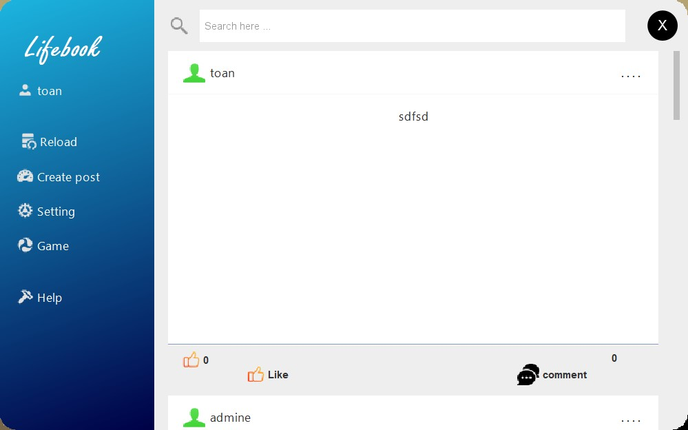
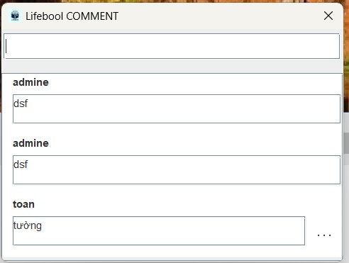
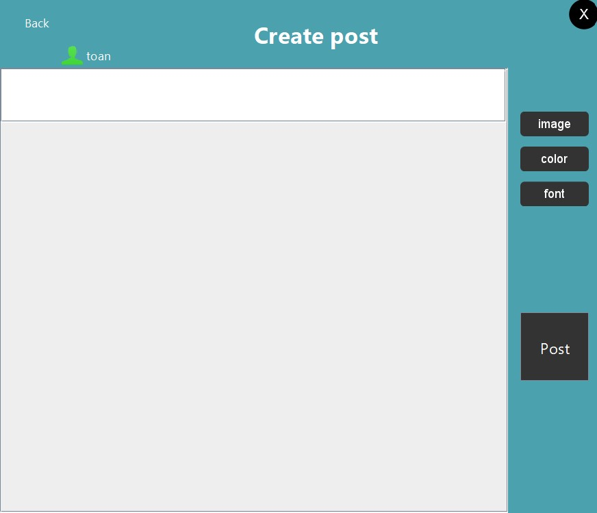
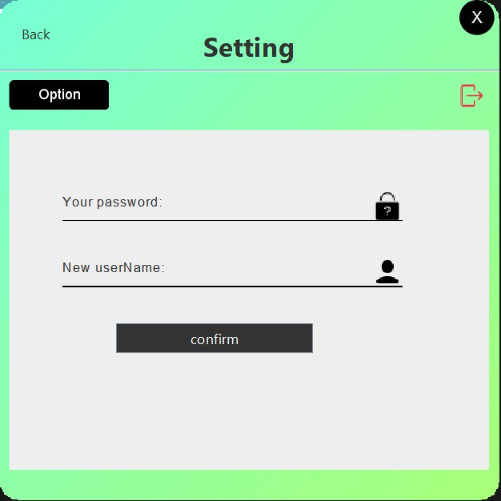
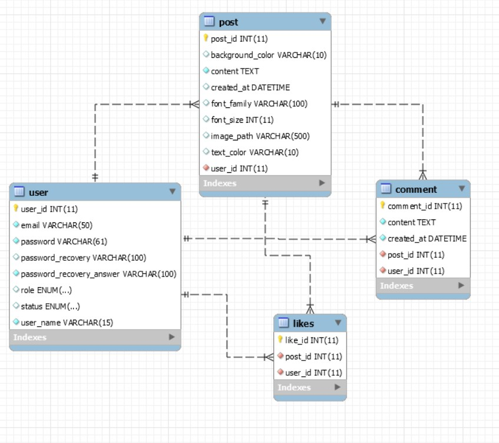

# Lifebook-Wato

**Lifebook** là một ứng dụng mạng xã hội cho phép bạn đăng bài viết, 
trạng thái, chia sẻ hình ảnh và tương tác với người khác. Mục tiêu hoàn thành
bài tập lớn của lớp java private của câu lạc bộ HIT (HAUI)

### Các tính năng chính:
- Đăng nhập 
- Đăng kí tài khoản mới
- lấy lại mật khẩu bằng câu hỏi khôi phục
- xem bài viết
- tạo, xóa bài đăng
- Thích, bỏ thích bài đăng  
- thêm, sửa, xóa bình luận
- tìm kiếm bài đăng
- trò chơi bóng bàn
- cài đặt tài khoản :
  - thay đổi mật khẩu
  - thay đổi tên người dùng
  - thay đổi email
  - thay đổi câu hỏi khôi phục mật khẩu
  - thay đổi vai trò người dùng (admin)
  - thay đổi trạng thái tài khoản (admin)

## Hướng dẫn cài đặt và sử dụng
### yêu cầu
- Mysql.
- Java 17+
- Maven.
- IDE: IntelliJ hoặc Netbeans.

### làm sao để chạy project ?

- sao chép dự án từ github về máy cá nhân .
- cài đặt các thư viện cần thiết.
- đổi tên và mật khẩu của mysql trong file persistence.xml
- đổi phiên bản java phù hợp trong file pom.xml 

## cách sử dụng

1. Khởi động cơ sở dữ liệu.
2. tạo tài khoản admin ( chạy file Trash).
3. đăng ký nếu chưa có tài khoản
4. đăng nhập

### trang chủ

    

- bài viết mới nhất sẽ được hiển thị, hệ thống sẽ tải 10 bài đăng một nếu kéo đến cuối thanh scrollbar thì sẽ tải thêm 10 bài viết tiếp theo 
- nếu là bài đăng của tài khoản đang đăng nhập thì sẽ có chức năng xóa.
- nhập vài ô search để tìm kiếm dự trên nội dung text sau đó nhấn enter để tìm kiếm
- có thể nhấn like để thích, hoặc nhấn thêm 1 lần để bỏ thích
- nhấn vào comment để xem các bình luận

    

- nhập nội dung bình luận sau đó enter
- nếu là bình luận của tài khoản đang đăng nhập sẽ có chức năng xóa hoặc cập nhật

### tạo bài đăng (Create post)

      

- lựa chọn ảnh bằng nút image
- nhập thông tin muốn chia sẻ vào ô text trống phía trên
- lựa chọn màu chữ màu nền kiểu chữ cho văn bản
- để hoàn thành ấn nút post 
### cài đặt tài khoản (Setting)

      

- ấn click nút option sẽ hiện ra 1 pop up chứa các chức năng
- lưu ý: chỉ có thể tạo tài khoản admin bằng cách dùng 1 tài khoản admin đổi role của 1 user (mặc định khi tạo là user)
- hệ thống sẽ tự nhận diện vai trò của tài khoản đang dùng nếu là admin sẽ có 6 chức năng, user sẽ có 4 chức năng
- chỉ admin mới có quyền thay đổi vai trò và trạng thái của tài khoản
- có thể đăng xuất trong Setting

### trò chơi bóng bàn (Game)
- người chơi bên trái di chuyển lên : "w"  xuống : "s"
- người chơi bên phải di chuyển lên xuống bằng mũi tên
- bóng đi qua gôn bên nào thì đối thủ ghi 1 điểm
  
## Các công nghệ đã dùng

### Java Swing
- **Kéo thả và code tạo giao diện chính**: Java Swing được sử dụng để xây dựng giao diện người dùng của ứng dụng.
- **Các thư viện cài đặt thêm của Java Swing**:
  - **FlatLaf**: Giúp tạo giao diện hiện đại hơn cho Java Swing, cải thiện trải nghiệm người dùng với giao diện phẳng, tối giản.
  - **JFontChooser**: Hỗ trợ người dùng chọn font chữ trong ứng dụng, mang lại tính linh hoạt trong việc thay đổi kiểu chữ.

### MySQL
- **Kết nối với cơ sở dữ liệu MySQL**: Sử dụng MySQL làm hệ quản trị cơ sở dữ liệu để lưu trữ và quản lý dữ liệu của người dùng và các bài viết.

### Hibernate
- Quản lý kết nối, ánh xạ các class từ java với các bảng trong database  

### JBCrypt
- **Mã hóa thông tin người dùng**: Sử dụng JBCrypt để mã hóa mật khẩu và các thông tin nhạy cảm của người dùng khi lưu vào cơ sở dữ liệu, bảo mật thông tin tốt hơn.
- 
## Sơ đồ quan hệ 

  

## Cấu trúc thư mục
⚒️ **HIT_Social_Network**

🗂️ social_network  
  ├ 📁 src/main  
  │    ├ 📁 java  
  │    │    ├ 📁 common (các phương thức chung)  
  │    │    │    ├ 🖇 check.java  
  │    │    │    ├ 🖇 EffecButtonLable.java  
  │    │    │    ├ 🖇 ImageIconCustom.java  
  │    │    │    ├ 🖇 PasswordEncryptor.java  
  │    │    │    ├ 🖇 SetScaledImage.java  
  │    │    │    ├ 🖇 Trash.java  
  │    │    │    └ 🖇 ValidateContant.java   
  │    │    ├ 📁 controller (xử lý các hành động từ người dùng)      
  │    │    │    ├ 🖇 CreatePostController2.java  
  │    │    │    ├ 🖇 FlashScreenController2.java  
  │    │    │    ├ 🖇 ForgotPasswordController2.java  
  │    │    │    ├ 🖇 GameTableTennis.java  
  │    │    │    ├ 🖇 LoginAndRegisterController2.java  
  │    │    │    ├ 🖇 PersonalController2.java  
  │    │    │    ├ 🖇 SettingController2.java  
  │    │    │    ├ 🖇 SignUpController2.java  
  │    │    │    └ 🖇 UserSession.java  
  │    │    ├ 📁 dao (tương tác với cơ sở dữ liệu)   
  │    │    │    ├ 🖇 PostDao.java  
  │    │    │    └ 🖇 UserDao.java  
  │    │    ├ 📁 model (các đối tượng )  
  │    │    │    ├ 🖇 Comment.java  
  │    │    │    ├ 🖇 Likes.java  
  │    │    │    ├ 🖇 Post.java  
  │    │    │    ├ 🖇 Role.java  
  │    │    │    ├ 🖇 Status.java  
  │    │    │    └ 🖇 User.java  
  │    │    ├ 📁 service (liên kết với cơ sở dữ liệu thông qua DAO)    
  │    │    │    ├ 🖇 EntityManagerUtil.java  
  │    │    │    ├ 🖇 Service.java  
  │    │    │    └ 🖇 ServiceInterfaces.java  
  │    │    ├ 📁 view (giao diện chính )   
  │    │    │    ├ 📁 component (các thành phần custom của giao diện )   
  │    │    │    ├ 🖇 CreatePostView2.java  
  │    │    │    ├ 🖇 FlashScreen2.java  
  │    │    │    ├ 🖇 ForgotPassword2.java  
  │    │    │    ├ 🖇 HelpView.java  
  │    │    │    ├ 🖇 LoginAndRegister2.java  
  │    │    │    ├ 🖇 PersonalView2.java  
  │    │    │    ├ 🖇 SettingView2.java  
  │    │    │    └ 🖇 SignUp2.java  
  │    ├ 📁 resources (thông tin dự án)    
  │    │    ├ 📁 META-INF  
  │    │    │    └ 🛠️ persistence.xml  
  ├ 🛠️ pom.xml  (thông tin thư viện)  
  └ 📜 README.md (giới thiệu và Hướng dẫn sử dụng) 
